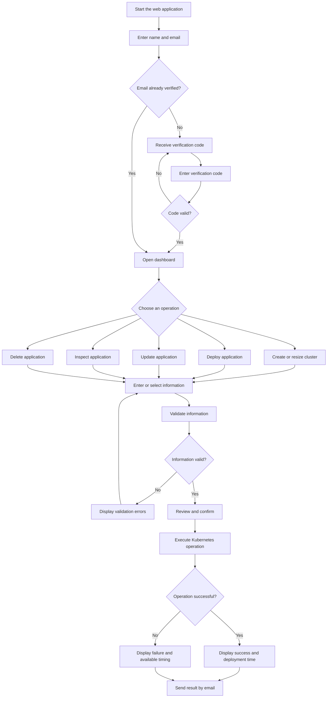

# Zero-Touch Kubernetes Cluster Deployment

## Project Overview

Zero-Touch Kubernetes Cluster Deployment is a Flask-based web application for managing local Minikube clusters and deploying containerized applications through a browser interface.

The application generates Kubernetes Deployment and Service manifests and performs the required Docker, Minikube, and `kubectl` operations. This allows users to work with Kubernetes without manually writing YAML files or running every Kubernetes command.

The system runs locally and uses Docker Desktop, Minikube, and `kubectl` installed on the operator's computer.

---

## Main Features

- Email verification using a six-digit code
- Local Minikube cluster creation
- Support for clusters containing 1-5 nodes
- Automatic startup of existing stopped clusters
- Reuse and resizing of existing clusters
- Application deployment using container images
- Configuration of replicas, port, CPU, and memory
- Application updates
- Application status inspection
- Application deletion
- Input validation before execution
- Kubernetes Deployment and Service generation
- Operation results displayed in the web UI
- Success or failure notifications sent by email
- Cluster deployment time displayed in the UI and email
- Application deployment time displayed in the UI and email
- Local ownership filtering based on verified email addresses
- One-use confirmation tokens to reduce duplicate operations
- Basic Kubernetes Pod replacement and replica maintenance

---

## Simple System Workflow



---

## Requirements

Install the following programs before using the project:

| Program | Purpose |
|---|---|
| Python 3.10 or newer | Runs the Flask application |
| Git | Downloads and updates the project |
| Docker Desktop | Provides the container runtime |
| Minikube | Creates local Kubernetes clusters |
| kubectl | Applies and verifies Kubernetes resources |
| Web browser | Opens the web interface |
| Gmail account | Sends verification codes and operation results |

Check the required programs from PowerShell:

```powershell
py --version
git --version
docker --version
minikube version
kubectl version --client
```

Each command should display version information.

If a command is not recognized, install the missing program and ensure it is available through the Windows `PATH`.

---

## Download and Installation

### Option 1: Clone the repository

Open PowerShell in the folder where you want to download the project:

```powershell
git clone https://github.com/SenSeLab26/K8s-Cluster-Deployment-Scenario1.git
cd K8s-Cluster-Deployment-Scenario1
```

### Option 2: Download the ZIP file

1. Open the [GitHub repository](https://github.com/SenSeLab26/K8s-Cluster-Deployment-Scenario1).
2. Click the green **Code** button.
3. Select **Download ZIP**.
4. Extract the downloaded file.
5. Open PowerShell inside the extracted project folder.

### Create a virtual environment

```powershell
py -3 -m venv .venv
```

Activate it:

```powershell
.\.venv\Scripts\Activate.ps1
```

The PowerShell prompt should begin with:

```text
(.venv)
```

If PowerShell blocks the activation script:

```powershell
Set-ExecutionPolicy -Scope Process -ExecutionPolicy Bypass
.\.venv\Scripts\Activate.ps1
```

This execution-policy change applies only to the current PowerShell window.

Do not copy `.venv` from another computer. Create a fresh virtual environment on every destination machine.

### Install the Python packages

Ensure the virtual environment is active:

```powershell
python -m pip install --upgrade pip
pip install -r requirements.txt
```

Wait until installation finishes without errors.

---

## Gmail Configuration

The application uses Gmail to send:

- Six-digit email verification codes
- Kubernetes operation results
- Cluster deployment time
- Application deployment time

### Create a Google App Password

1. Open your Google Account.
2. Select **Security**.
3. Enable **2-Step Verification**.
4. Open **App Passwords**.
5. Create an App Password.
6. Copy the generated password.

Use the generated App Password, not the normal Gmail password.

### Configure the Gmail environment variables

In the same PowerShell window that will run Flask:

```powershell
$env:SENDER_EMAIL = "your-email@gmail.com"
$env:GMAIL_APP_PASSWORD = "your-google-app-password"
```

Replace the placeholders with your real information.

These variables are temporary. Configure them again after closing and reopening PowerShell.

Never place your Gmail password or App Password directly inside the project files.

### Optional Flask settings

The application works without manually configuring these settings:

```powershell
$env:FLASK_SECRET_KEY = "replace-with-a-long-random-secret"
$env:FLASK_DEBUG = "0"
```

If `FLASK_SECRET_KEY` is missing, the application generates a temporary random secret when it starts. This is suitable for local testing, but restarting the application invalidates existing browser sessions.

Debug mode is disabled unless `FLASK_DEBUG` is explicitly set to `1`.

The repository contains `.env.example` as a configuration reference. The current application does not automatically load `.env` files, so environment variables must be configured in PowerShell before starting Flask.

---

## Start the System

### 1. Start Docker Desktop

Starting Docker Desktop manually before using the application is recommended.

Open Docker Desktop and wait for the Docker Engine to become ready.

Check Docker:

```powershell
docker info
```

The application also checks Docker before executing a Kubernetes operation. On Windows, it may attempt to locate and start Docker Desktop automatically if the engine is stopped.

### 2. Activate the virtual environment

```powershell
.\.venv\Scripts\Activate.ps1
```

### 3. Configure Gmail

If the Gmail variables are not already configured:

```powershell
$env:SENDER_EMAIL = "your-email@gmail.com"
$env:GMAIL_APP_PASSWORD = "your-google-app-password"
```

### 4. Start Flask

```powershell
python app.py
```

### 5. Open the web interface

Open:

[http://127.0.0.1:5000](http://127.0.0.1:5000)

Keep the PowerShell window open while using the application.

To stop Flask, return to PowerShell and press:

```text
Ctrl + C
```

---

## How to Use the Web UI

### Verify your email

1. Enter your name.
2. Enter your email address.
3. Continue to the verification page.
4. Check your email for the six-digit code.
5. Enter the code in the web interface.
6. Submit the code.

The verification code expires after two minutes.

Users have a maximum of five incorrect attempts.

Previously verified email addresses are stored in the local SQLite database and may continue directly to the dashboard.

### Create or resize a cluster

1. Select **Create cluster**.
2. Enter a cluster name.
3. Enter a node count from 1 to 5.
4. Review the operation.
5. Confirm it.
6. Wait for Minikube to complete the operation.
7. Review the result.

Cluster names are normalized automatically. For example:

```text
My Cluster
```

becomes:

```text
my-cluster
```

Depending on the existing state, the system can:

- Create a new Minikube cluster
- Start a stopped cluster
- Reuse a running cluster
- Add worker nodes
- Remove worker nodes
- Verify that the requested nodes become Ready

The result UI and operation email display:

```text
Cluster deployment time: X.XX seconds
```

### Deploy an application

1. Select **Deploy application**.
2. Select an existing cluster.
3. Enter the application configuration.
4. Review the values.
5. Confirm the operation.
6. Wait for Kubernetes to create and verify the resources.
7. Review the result.

Application inputs:

| Input | Example | Accepted range |
|---|---|---|
| Application name | `nginx-app` | Kubernetes-compatible name |
| Container image | `nginx:1.27-alpine` | Valid image reference |
| Replicas | `3` | 1-100 |
| Container port | `80` | 1-65535 |
| CPU request | `100` | 1-1000 millicores |
| Memory request | `128` | 1-1024 MiB |

Enter CPU and memory as plain numbers.

For example:

```text
CPU: 100
Memory: 128
```

The application converts these values to:

```text
CPU request: 100m
Memory request: 128Mi
```

The application uses fixed maximum limits:

```text
CPU limit: 1000m
Memory limit: 1024Mi
```

The result UI and operation email display:

```text
Application deployment time: X.XX seconds
```

Application deployment time includes:

- Generating Kubernetes YAML
- Applying the Deployment
- Applying the Service
- Waiting for the Deployment to become ready

It does not include cluster preparation or email transmission time.

### Update an application

1. Select **Update application**.
2. Select an existing application.
3. The associated cluster is selected automatically.
4. Change the required configuration.
5. Review the new values.
6. Confirm the operation.
7. Wait for Kubernetes to apply and verify the update.

The application name cannot be changed during an update.

The update can change:

- Container image
- Replica count
- Container port
- CPU request
- Memory request

The UI and email display the application deployment time.

### Inspect an application

1. Select **Inspect application**.
2. Select an existing application.
3. The associated cluster is selected automatically.
4. Confirm the operation.
5. Review the Kubernetes information.

Inspection may display:

- Deployment information
- Pod status
- Service information
- Container image
- Replica status
- Resource settings

Inspection does not modify the application.

### Delete an application

1. Select **Delete application**.
2. Select an existing application.
3. The associated cluster is selected automatically.
4. Review the application carefully.
5. Confirm deletion.
6. Wait for the result.

This deletes the application's Kubernetes Deployment and Service.

It does not delete the Minikube cluster.

---

## Verify the Results

Do not rely only on the web result page. Use `kubectl` to verify the actual Kubernetes state.

Replace `<cluster-name>` with the selected cluster.

### List Minikube profiles

```powershell
minikube profile list
```

### Check cluster status

```powershell
minikube status -p <cluster-name>
```

### Check cluster nodes

```powershell
kubectl --context <cluster-name> get nodes
```

All requested nodes should eventually show:

```text
Ready
```

### Check Deployments

```powershell
kubectl --context <cluster-name> get deployments
```

### Check Pods

```powershell
kubectl --context <cluster-name> get pods
```

Successfully started Pods normally show:

```text
Running
```

### Check Pod distribution

```powershell
kubectl --context <cluster-name> get pods -o wide
```

The `NODE` column shows which node runs each Pod.

### Check Services

```powershell
kubectl --context <cluster-name> get services
```

### Check all important resources

```powershell
kubectl --context <cluster-name> get deployments,pods,services
```

### Verify an application deletion

```powershell
kubectl --context <cluster-name> get deployments
kubectl --context <cluster-name> get pods
kubectl --context <cluster-name> get services
```

The deleted application should no longer appear.

---

## Troubleshooting

### Docker is not running

Open Docker Desktop and wait until it becomes ready.

```powershell
docker info
```

Retry the operation after this command succeeds.

### A required command is not recognized

Example:

```text
'minikube' is not recognized
```

Install the missing program and ensure it is included in the Windows `PATH`.

Restart PowerShell after updating `PATH`.

### Virtual environment cannot be activated

```powershell
Set-ExecutionPolicy -Scope Process -ExecutionPolicy Bypass
.\.venv\Scripts\Activate.ps1
```

### Existing virtual environment no longer works

Delete and recreate `.venv` from inside the project directory:

```powershell
Remove-Item -Recurse -Force .venv
py -3 -m venv .venv
.\.venv\Scripts\Activate.ps1
pip install -r requirements.txt
```

Confirm that PowerShell is inside the project directory before removing `.venv`.

### Verification email was not received

Check that:

- The email address is correct.
- The message is not in spam.
- Gmail two-step verification is enabled.
- A Google App Password is being used.
- The environment variables were configured in the current terminal.
- Flask was started from the same terminal.
- The verification code has not expired.

### Operation email settings are not configured

Stop Flask and set:

```powershell
$env:SENDER_EMAIL = "your-email@gmail.com"
$env:GMAIL_APP_PASSWORD = "your-google-app-password"
```

Restart Flask from the same PowerShell window.

### `ImagePullBackOff` or `ErrImagePull`

Test the image:

```powershell
docker pull <image-name>
```

Inspect the Pod:

```powershell
kubectl --context <cluster-name> describe pod <pod-name>
```

### Pod remains Pending

```powershell
kubectl --context <cluster-name> describe pod <pod-name>
```

Possible causes:

- Insufficient CPU
- Insufficient memory
- Nodes are not ready
- Scheduling constraints
- Cluster still starting

### Pod is running but not ready

```powershell
kubectl --context <cluster-name> logs <pod-name>
kubectl --context <cluster-name> describe pod <pod-name>
```

### Cluster node is NotReady

```powershell
minikube status -p <cluster-name>
kubectl --context <cluster-name> get nodes
```

Restart the cluster if necessary:

```powershell
minikube stop -p <cluster-name>
minikube start -p <cluster-name>
```

### Deployment does not become ready

```powershell
kubectl --context <cluster-name> describe deployment <application-name>-deployment
kubectl --context <cluster-name> get pods
kubectl --context <cluster-name> describe pod <pod-name>
kubectl --context <cluster-name> logs <pod-name>
```

### Service application failed

A Deployment may remain after a Service failure.

Inspect existing resources before retrying:

```powershell
kubectl --context <cluster-name> get deployments,services
```

---

## Temporary Public Access

By default, the web interface is available only on the operator's computer.

For a controlled demonstration, Cloudflare Quick Tunnel can provide a temporary public link.

Start Flask:

```powershell
python app.py
```

Open another PowerShell window:

```powershell
cloudflared tunnel --url http://127.0.0.1:5000
```

Cloudflare displays a temporary public URL.

The following must remain running:

- Operator's computer
- Docker Desktop
- Flask application
- Required Minikube cluster
- Cloudflare tunnel

This is temporary demonstration access, not permanent production hosting.

Before using a public tunnel:

- Ensure `FLASK_DEBUG` is not set to `1`.
- Use only non-sensitive test resources.
- Share the URL only with trusted users.
- Remember that inspection output may contain infrastructure details.
- Stop the tunnel immediately after the demonstration.

---

## Security Notes

- Never upload a Gmail App Password to GitHub.
- Never write passwords directly inside Python files.
- Never commit a real `.env` file.
- Do not commit `verified_emails.db`.
- Do not commit `.venv`.
- Do not commit generated runtime manifests unless intentionally required.
- Do not expose Flask debug mode publicly.
- Do not use the Flask development server for permanent hosting.
- Treat raw Kubernetes inspection output as sensitive.
- Use proper authentication and Kubernetes RBAC before production use.
- Local ownership records are not equivalent to Kubernetes authorization.
- Use administrator-controlled roles and field visibility in a professional shared deployment.

Recommended `.gitignore`:

```gitignore
.venv/
venv/
__pycache__/
*.pyc
generated/
.vscode/
verified_emails.db
.env
*.log
.pytest_cache/
```
