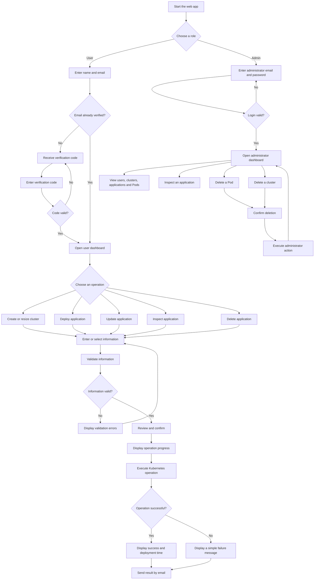

# Zero-Touch Kubernetes Web Service

## Project Overview

I built this web app to make local Kubernetes management easier. Users can create Minikube clusters and manage containerized applications through a browser instead of writing Kubernetes commands and YAML files manually.

The app supports normal users and an administrator. Users manage their own clusters and applications. The administrator can view all resources and delete clusters or Pods.

---

## Main Features

- Email verification using a six-digit code
- User and Administrator roles
- Minikube clusters with 1-5 nodes
- Cluster creation, startup, reuse, and resizing
- Application deployment and updates
- Application inspection and deletion
- Replica, port, CPU, and memory settings
- Operation progress and result pages
- Email notifications
- Administrator dashboard
- Administrator-only cluster and Pod deletion

---

## System Workflow



---

## Setup

All commands below are entered in the Ubuntu Terminal.

### Step 1: Check the Required Programs

```bash
git --version
python3 --version
docker --version
minikube version
kubectl version --client
```

If all commands display version information, continue to **Step 5**.

If Git, Python, Docker, or curl is missing, complete Step 2.

If kubectl is missing, complete Step 3.

If Minikube is missing, complete Step 4.

### Step 2: Install Git, Python, Docker, and curl

Skip this step if these programs are already installed.

```bash
sudo apt update
sudo apt install -y git curl python3 python3-pip python3-venv docker.io
sudo systemctl enable --now docker
sudo usermod -aG docker "$USER"
```

Log out of Ubuntu and log in again. Then check Docker:

```bash
docker info
```

### Step 3: Install kubectl

Skip this step if kubectl is already installed.

```bash
curl -LO "https://dl.k8s.io/release/$(curl -L -s https://dl.k8s.io/release/stable.txt)/bin/linux/amd64/kubectl"
sudo install -o root -g root -m 0755 kubectl /usr/local/bin/kubectl
rm kubectl
```

Check it:

```bash
kubectl version --client
```

### Step 4: Install Minikube

Skip this step if Minikube is already installed.

```bash
curl -LO https://github.com/kubernetes/minikube/releases/latest/download/minikube-linux-amd64
sudo install minikube-linux-amd64 /usr/local/bin/minikube
rm minikube-linux-amd64
minikube config set driver docker
```

Check it:

```bash
minikube version
```

The kubectl and Minikube commands use AMD64. If the computer uses ARM64, replace `amd64` with `arm64`.

### Step 5: Set the System Limit

This prevents the Minikube `Too many open files` error.

```bash
echo "fs.inotify.max_user_instances=1024" | sudo tee /etc/sysctl.d/99-minikube.conf
sudo sysctl --system
```

### Step 6: Download the Project

```bash
cd ~/Desktop
git clone https://github.com/SenSeLab26/K8s-Cluster-Deployment-Web-Service.git
cd K8s-Cluster-Deployment-Web-Service
```

If the repository is private, sign in with an authorized GitHub account.

### Step 7: Create the Python Environment

```bash
python3 -m venv .venv
source .venv/bin/activate
pip install -r requirements.txt
```

The Terminal will start with `(.venv)`.

### Step 8: Configure Email

In a web browser:

1. Open the Google Account used to send emails.
2. Open **Security**.
3. Enable **2-Step Verification**.
4. Open **App Passwords**.
5. Create and copy a Google App Password.

Return to the Ubuntu Terminal:

```bash
export SENDER_EMAIL="k8sadmin@gmail.com"
export GMAIL_APP_PASSWORD="cbtr rpjj jobp awhj"
```

### Step 9: Start the App

```bash
python app.py
```

Keep the Terminal open and visit:

[http://127.0.0.1:5000](http://127.0.0.1:5000)

---

## Start the App Again Later

The installation steps are only needed once.

Open the Ubuntu Terminal and run:

```bash
cd ~/Desktop/K8s-Cluster-Deployment-Web-Service
sudo systemctl start docker
source .venv/bin/activate
export SENDER_EMAIL="k8sadmin@gmail.com"
export GMAIL_APP_PASSWORD="cbtr rpjj jobp awhj"
python app.py
```

Keep the Terminal open and visit:

[http://127.0.0.1:5000](http://127.0.0.1:5000)

---

## How to Use the App

### User Verification

1. Open the app.
2. Select **User**.
3. Enter a name and email.
4. Enter the six-digit code received by email.
5. Open the user dashboard.

### Create or Resize a Cluster

1. Select **Create cluster**.
2. Enter a cluster name.
3. Enter a node count from 1 to 5.
4. Review and confirm the operation.
5. Keep the progress page open.
6. Wait for the result.

The app can create a cluster, start a stopped cluster, reuse a running cluster, or resize it.

### Deploy an Application

1. Select **Deploy application**.
2. Select a cluster.
3. Enter the application information.
4. Review and confirm the operation.
5. Keep the progress page open.
6. Wait for the result.

| Input | Example |
|---|---|
| Application name | `nginx-app` |
| Container image | `nginx:latest` |
| Replicas | `3` |
| Container port | `80` |
| CPU request | `100` |
| Memory request | `128` |

### Update an Application

1. Select **Update application**.
2. Select an application.
3. Change the required values.
4. Review and confirm the operation.
5. Wait for the result.

### Inspect an Application

1. Select **Inspect application**.
2. Select an application.
3. Confirm the operation.
4. Review its Deployment, Pods, and Service.

### Delete an Application

1. Select **Delete application**.
2. Select an application.
3. Review and confirm the deletion.
4. Wait for the result.

This deletes the application's Deployment and Service. It does not delete the cluster.

---

## Administrator

### Administrator Login Details

```text
Email: k8sadmin@gmail.com
Password: k8s_icps_k8s
```

### First Login

1. Select **Admin**.
2. Enter the administrator email shown above.
3. Enter the verification code received by email.
4. Create the administrator password shown above.
5. Open the administrator dashboard.

### Later Logins

1. Select **Admin**.
2. Enter the administrator email.
3. Enter the administrator password.
4. Select **Login**.

Use **Forgot password** if the password needs to be reset.

### Administrator Actions

The administrator can:

- View all users, clusters, applications, and Pods
- Inspect applications
- Delete any Pod
- Delete any cluster

Deleting a cluster permanently deletes everything inside it.

## Check the Resources

Replace `<cluster-name>` with the real cluster name.

```bash
minikube profile list
minikube status -p <cluster-name>
kubectl --context <cluster-name> get nodes
kubectl --context <cluster-name> get deployments
kubectl --context <cluster-name> get pods -o wide
kubectl --context <cluster-name> get services
```

---

## Troubleshooting

### Docker Is Stopped

```bash
sudo systemctl start docker
docker info
```

### A Cluster Is Stopped

```bash
minikube start -p <cluster-name>
```

### Too Many Open Files

```bash
echo "fs.inotify.max_user_instances=1024" | sudo tee /etc/sysctl.d/99-minikube.conf
sudo sysctl --system
minikube start -p <cluster-name>
```

### Check a Failed Pod

```bash
kubectl --context <cluster-name> describe pod <pod-name>
kubectl --context <cluster-name> logs <pod-name>
```

---

## Security Notes

- Never upload the Gmail password or Google App Password.
- Do not commit `.venv`, the database, or log files.
- Use a separate administrator password for testing.
- Remove test credentials before making the repository public.

Recommended `.gitignore`:

```gitignore
.venv/
__pycacheJwt__/
*.pyc
generated/
verified_emails.db
.env
*.log
.pytest_cache/
```

---

## Current Scope

This version supports public container images and local Minikube clusters.

The next step is to support private container images.
