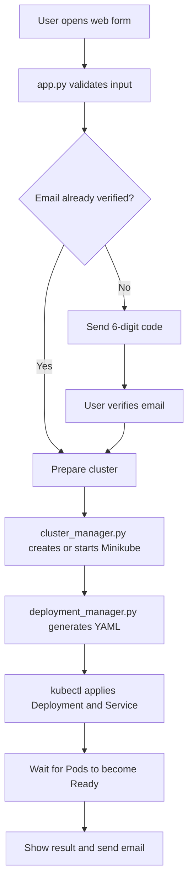

# Zero-Touch Kubernetes Deployment Application

The Zero-Touch Kubernetes Deployment Application is a Flask-based web application that automates the creation of a Minikube cluster and the deployment of containerized applications to Kubernetes.

Instead of manually writing Kubernetes YAML files and running several commands, the user enters the required configuration through a web form. The application then verifies the email address, prepares the cluster, generates the Kubernetes Deployment and Service files, applies them, and waits for the Pods to become ready.

## Main Features

- Simple web interface built with Flask
- Email verification using a 6-digit code
- Automatic checking of Docker, Minikube, and kubectl
- Automatic Minikube cluster creation and startup
- Support for single-node and multi-node clusters
- Dynamic generation of Kubernetes Deployment and Service files
- Configurable Docker image and container port
- Configurable number of replicas and nodes
- Configurable CPU and memory requests and limits
- Configurable namespace and Kubernetes Service type
- Automatic deployment using kubectl
- Automatic waiting until the Pods become ready
- Deployment result displayed through the website
- Email notification after deployment

## Application Workflow



## Main Files

- `app.py` runs the Flask web application and handles the form, email verification, and deployment requests.
- `cluster_manager.py` checks the required commands and creates, starts, or reuses the requested Minikube cluster.
- `deployment_manager.py` generates and applies the Kubernetes Deployment and Service files.
- `input_handler.py` validates the values entered by the user.
- `main.py` provides the command-line version of the deployment process.
- `requirements.txt deployment process.
- `` contains the required Python packages.
- `templates/` contains the HTML pages and Kubernetes Jinja templates.
- `static/style.css` contains the website styling.

## Requirements

Before using the application, install:

- Python 3
- Docker Desktop
- Minikube
- kubectl
- Git

An internet connection is required to download container images and send email notifications.

Docker Desktop must be running before the application creates or starts a Minikube cluster.

# User Manual

## 1. Download the Project

Open PowerShell and clone the repository:

```powershell
git clone https://github.com/SenSeLab26/K8s-Cluster-Deployment-Scenario1.git
```

Enter the project folder:

```powershell
cd K8s-Cluster-Deployment-Scenario1
```

## 2. Create a Virtual Environment

Create the Python virtual environment:

```powershell
py -m venv .venv
```

Activate it:

```powershell
.\.venv\Scripts\Activate.ps1
```

When it is activated, `(.venv)` should appear at the beginning of the PowerShell line.

If PowerShell prevents activation, run:

```powershell
Set-ExecutionPolicy -Scope Process -ExecutionPolicy Bypass
```

Then activate the environment again:

```powershell
.\.venv\Scripts\Activate.ps1
```

## 3. Install the Required Packages

Run:

```powershell
py -m pip install -r requirements.txt
```

This installs Flask, Jinja2, and the other Python packages required by the application.

## 4. Configure Email Notifications

The application uses a Gmail account to send verification codes and deployment notifications.

Set the sender email and Gmail App Password in the same PowerShell window:

```powershell
$env:SENDER_EMAIL="your-email@gmail.com"
$env:GMAIL_APP_PASSWORD="your-app-password"
```

Replace the example values with the email address and App Password used by the application.

Do not write the real App Password inside the source code or upload it to GitHub.

These environment variables are temporary. If you close PowerShell, you must set them again when you open a new window.

## 5. Start Docker Desktop

Open Docker Desktop and wait until the Docker Engine is running.

You can check it from PowerShell using:

```powershell
docker info
```

If this command produces Docker information without an engine connection error, Docker is ready.

## 6. Run the Application

From the project folder, run:

```powershell
py app.py
```

PowerShell should show that the Flask development server is running.

Open this address in your browser:

```text
http://127.0.0.1:5000
```

Do not close the PowerShell window while using the application.

## 7. Complete the Deployment Form

Enter the required information in the web form.

### User Information

- **Name:** The name of the user requesting the deployment.
- **Email:** The address that receives the verification code and deployment notification.

### Cluster Information

- **Cluster Name:** The name of the Minikube cluster.
- **Number of Nodes:** The number of Kubernetes nodes required in the cluster.

### Application Information

- **Application Name:** The name used for the Kubernetes Deployment and Service.
- **Docker Image:** The container image to deploy, such as `nginx`.
- **Replicas:** The number of Pod copies required.
- **Container Port:** The port used by the container.

### Resource Information

- **CPU Request:** The CPU guaranteed to each container, such as `100m`.
- **CPU Limit:** The maximum CPU allowed for each container, such as `1000m`.
- **Memory Request:** The memory guaranteed to each container, such as `128Mi`.
- **Memory Limit:** The maximum memory allowed for each container, such as `256Mi`.

`1000m` represents one CPU core, while `100m` represents one-tenth of a CPU core. `Mi` represents mebibytes of memory.

### Kubernetes Information

- **Namespace:** The Kubernetes namespace used for the resources. The common value is `default`.
- **Service Type:** The type of Kubernetes Service, such as `ClusterIP`, `NodePort`, or `LoadBalancer`.

## 8. Verify the Email Address

If the email address has not been verified before:

1. The application sends a 6-digit verification code.
2. Open the email inbox.
3. Copy the verification code.
4. Enter it on the verification page.
5. Submit the code.

After successful verification, the deployment process continues automatically.

## 9. Wait for the Deployment

The application will:

1. Validate the submitted values.
2. Check that Docker, Minikube, and kubectl are available.
3. Create a new Minikube cluster or reuse the requested cluster.
4. Add or start the required nodes.
5. Wait until the Kubernetes nodes become ready.
6. Generate the Deployment and Service YAML files.
7. Apply the files using kubectl.
8. Wait until the Pods become ready.
9. Display the deployment result.
10. Send a deployment notification by email.

Creating a new multi-node cluster may take several minutes.

Do not close Docker Desktop, PowerShell, or the browser while the deployment is running.

## 10. Verify the Kubernetes Resources

After deployment, open another PowerShell window and check the cluster profiles:

```powershell
minikube profile list
```

Select the required cluster context:

```powershell
kubectl config use-context CLUSTER_NAME
```

Replace `CLUSTER_NAME` with the cluster name entered in the form.

Check the nodes:

```powershell
kubectl get nodes
```

Check the Deployments:

```powershell
kubectl get deployments
```

Check the Pods and the nodes running them:

```powershell
kubectl get pods -o wide
```

Check the Services:

```powershell
kubectl get services
```

For resources created in a different namespace, add:

```powershell
-n NAMESPACE_NAME
```

For example:

```powershell
kubectl get pods -n test-namespace -o wide
```

## Example Configuration

The following values can be used for a simple test:

| Field | Example |
|---|---|
| Cluster name | `multi-node` |
| Number of nodes | `2` |
| Application name | `test-app` |
| Docker image | `nginx` |
| Replicas | `3` |
| Container port | `80` |
| CPU request | `100m` |
| CPU limit | `1000m` |
| Memory request | `128Mi` |
| Memory limit | `256Mi` |
| Namespace | `default` |
| Service type | `ClusterIP` |

The application is not limited to Nginx. Other container images can be used when they are available in an accessible container registry and the correct container port is provided.

## Troubleshooting

### Docker Engine Is Not Running

If the application reports that Docker is unavailable:

1. Open Docker Desktop.
2. Wait until the Docker Engine starts.
3. Run the deployment again.

Check Docker using:

```powershell
docker info
```

### Minikube Cluster Does Not Start

Check the cluster status:

```powershell
minikube status -p CLUSTER_NAME
```

Start it manually if necessary:

```powershell
minikube start -p CLUSTER_NAME
```

For a multi-node cluster:

```powershell
minikube start -p CLUSTER_NAME --nodes 2
```

### Pod Remains Pending

Inspect the Pod:

```powershell
kubectl describe pod POD_NAME
```

A Pod may remain pending when the cluster does not have enough CPU or memory for the requested resources.

Try using smaller resource values, such as:

```text
CPU request: 100m
CPU limit: 500m
Memory request: 64Mi
Memory limit: 128Mi
```

### Image Cannot Be Pulled

Check the Pod status:

```powershell
kubectl get pods
```

Inspect the affected Pod:

```powershell
kubectl describe pod POD_NAME
```

Confirm that:

- The Docker image name is spelled correctly.
- The image exists in the container registry.
- The image is public, or Kubernetes has permission to access it.
- The computer has an internet connection.

### Email Is Not Received

Check that:

- The email address is correct.
- The sender email is configured.
- The Gmail App Password is correct.
- The message is not in the spam folder.
- The environment variables were set in the same PowerShell window running `app.py`.

### PowerShell Cannot Activate the Virtual Environment

Run:

```powershell
Set-ExecutionPolicy -Scope Process -ExecutionPolicy Bypass
```

Then:

```powershell
.\.venv\Scripts\Activate.ps1
```

## Stopping the Application

To stop the Flask application, return to its PowerShell window and press:

```text
Ctrl + C
```

To stop a Minikube cluster without deleting it:

```powershell
minikube stop -p CLUSTER_NAME
```

To start it again later:

```powershell
minikube start -p CLUSTER_NAME
```

## Important Notes

- Keep Docker Desktop running while creating or managing clusters.
- Never upload email passwords or Gmail App Passwords to GitHub.
- Use valid Kubernetes resource values such as `100m` for CPU and `128Mi` for memory.
- The Docker image must be accessible to Kubernetes.
- Cluster creation may take several minutes.
- Generated YAML files, verification data, virtual environments, and cache files should remain excluded through `.gitignore`.
- Verify the deployment using `kubectl get nodes`, `kubectl get pods -o wide`, and `kubectl get services`.
